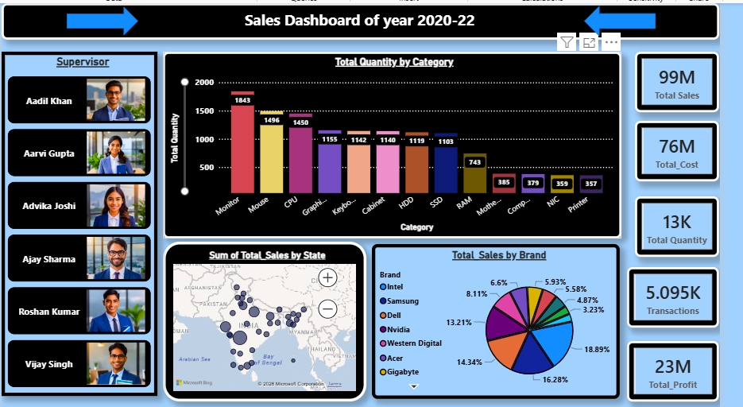

# 📊 Sales Analysis Dashboard

## 📌 Project Overview

An interactive Sales Analysis Dashboard created using Microsoft Power BI to analyze sales performance for the period 2020–2022.

The dashboard provides insights into sales, cost, profit, quantity, transactions, product categories, brands, states, and supervisors.

## 🛠️ Tools & Technologies

- Microsoft Power BI
- Data Analysis
- Data Visualization
- Interactive Dashboard

## 📈 Key Metrics

| Metric | Value |
|---|---:|
| Total Sales | 99M |
| Total Cost | 76M |
| Total Quantity | 13K |
| Transactions | 5.095K |
| Total Profit | 23M |

## 📊 Dashboard Features

- Category-wise quantity analysis
- State-wise sales analysis
- Brand-wise sales distribution
- Supervisor-wise performance view
- Total Sales, Cost and Profit KPIs
- Transaction and quantity analysis
- Interactive Power BI visualizations

## 🎯 Project Objective

The objective of this project is to transform sales data into an interactive dashboard that helps users understand business performance and identify important sales trends.

## 🖼️ Dashboard Preview

## 📁 Project Files

- `salesDashboard.pbix` — Power BI dashboard file
- `dashboard-preview.png` — Dashboard preview image
- `README.md` — Project documentation
